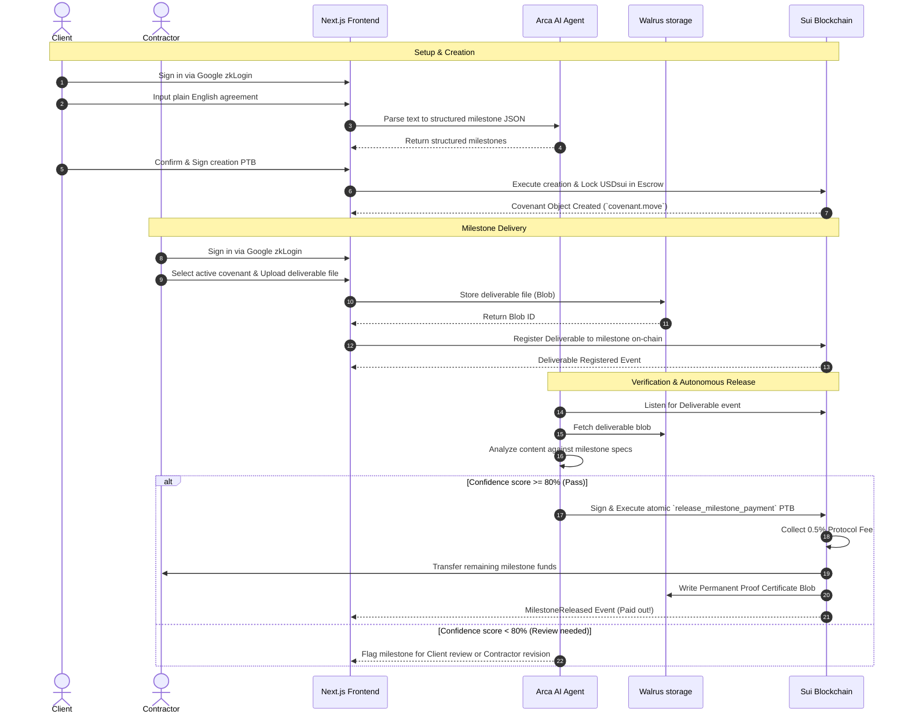

# Accord — Autonomous Work Verification & Payment Protocol

> **Sui Overflow 2026 Hackathon**  
> *Work. Verify. Pay. Automatically.*

Accord is the world's first autonomous work verification and payment protocol. It sits trustlessly between clients and service providers, using an autonomous AI Agent (**Arca**) to analyze and verify deliverables uploaded to **Walrus Storage**, automatically releasing escrowed **USDsui** milestone payments via Sui Programmable Transaction Blocks (PTBs).

---

## 🧭 The Core Concept & Vision

In traditional freelancing and contract markets, trust is expensive. Platforms like Upwork charge up to 20% in fees, while direct contract transactions suffer from non-payment, delayed wire transfers, and disputes. 

Accord solves this by shifting trust to cryptographic and agentic enforcement:
- **Zero-Friction Authentication**: Users login seamlessly using **Sui zkLogin** (e.g., using a standard Google OAuth account). No wallet extensions or private key seed phrases are needed.
- **Autonomous Escrow Verification**: The contract amount is held securely in a Sui smart contract. Milestone deliverables are uploaded to **Walrus testnet** (immutable and decentralized storage).
- **The Arca Agent**: An AI evaluator (built on Groq LLM) fetches the deliverable from Walrus, evaluates it against the covenant guidelines, and atomically triggers payment release if requirements are met.
- **Sealed Proof Certificates**: Every successful delivery generates a cryptographic Proof Certificate, stored permanently on Walrus, creating a portable reputation profile.

---

## 🎨 System Flow & Architecture Diagrams

### 1. Conceptual Flow (How it Works)

```
   1. COVENANT CREATION          2. ESCROW FUNDING           3. WORK DELIVERY         4. AUTONOMOUS PAYOUT
  +-----------------------+   +---------------------+   +---------------------+   +---------------------+
  | Client details brief  |   | Escrow initialized  |   | Contractor uploads  |   | Arca Agent verifies |
  | in plain English. AI  |-->| with USDsui coins.  |-->| milestone work      |-->| deliverable against |
  | structures covenants  |   | Secured on-chain.   |   | directly to Walrus. |   | brief & pays out.   |
  +-----------------------+   +---------------------+   +---------------------+   +---------------------+
```

### 2. High-Level Architecture

```
+-------------------------------------------------------------------------------------+
|                                   ACCORD SYSTEM                                     |
+-------------------------------------------------------------------------------------+
|                                                                                     |
|    +----------------------+                         +---------------------------+   |
|    |     Client UI        |                         |      Contractor UI        |   |
|    +----------+-----------+                         +-------------+-------------+   |
|               | (Google zkLogin)                                  | (Google zkLogin) |
|               v                                                   v                 |
|    +----------------------------------------------------------------------------+   |
|    |                              Next.js Frontend                              |   |
|    +----------+---------------------------+---------------------------+---------+   |
|               |                           |                           |             |
|               | 1. Submit Brief           | 2. Upload Blob            | 4. Fetch Event
|               v                           v                           v             |
|      +-----------------+         +-----------------+         +------------------+   |
|      |   Arca Agent    |         |  Walrus Storage |         |  Sui Blockchain  |   |
|      |   (Groq LLM)    |         | (Decentralized  |         | (Covenant contract|  |
|      |                 |         |   Blob Store)   |         |  & USDsui Escrow)|  |
|      +--------+--------+         +--------+--------+         +--------+---------+   |
|               |                           ^                           ^             |
|               | 3. Read Deliverable       |                           |             |
|               +---------------------------+                           |             |
|               |                                                       |             |
|               +------------------ 5. Automate PTB Release ------------+             |
|                                                                                     |
+-------------------------------------------------------------------------------------+
```

### 3. Detailed Sequence Diagram



---

## 🛠️ Codebase Structure

```
Accord/
├── agent/                  # Node.js Agent Service (Arca Engine)
│   ├── src/
│   │   ├── certificate/    # PDF Certificate generation & Walrus certification engine
│   │   ├── executor/       # Atomic Sui PTB Execution services
│   │   ├── memory/         # Walrus Memory / reputation tracking
│   │   ├── prompts/        # Groq evaluation system prompts
│   │   ├── verifier/       # LLM Verifier & confidence metrics
│   │   └── index.ts        # Agent Server endpoint
│   └── tsconfig.json
│
├── contracts/              # Sui Move Smart Contracts
│   └── accord/
│       ├── Move.toml       # Package dependencies & network configuration
│       └── sources/
│           ├── covenant.move   # Core Escrow, Milestone, and Agreement logic
│           ├── proof.move      # Walrus Proof Certificate module
│           ├── reputation.move # Cross-project contractor scoring
│           ├── usdsui.move     # Test mock token wrapper for escrow transactions
│           └── errors.move     # Centrally defined contract error codes
│
└── frontend/               # Next.js 14 App Router UI
    ├── app/                # React pages (Dashboard, zkLogin Auth, Covenant Details)
    ├── components/         # UI Elements (ArcaChat, MilestoneTimeline, DeliveryUpload)
    └── lib/                # Sui/Walrus hooks, API wrappers, and zkLogin session state
```

---

## 🚀 Setup & Execution Instructions

Follow these instructions to run Accord locally.

### Prerequisites
- [Node.js v18+](https://nodejs.org/)
- [Sui CLI](https://docs.sui.io/guides/developer/getting-started/sui-install) (for contract validation/deployment)

---

### Step 1 · Frontend Setup

1. Navigate to the `frontend/` directory:
   ```bash
   cd frontend
   ```
2. Copy the environment variables:
   ```bash
   cp .env.example .env
   ```
3. Open `.env` and fill in your Google Client ID for zkLogin (see **Google OAuth Setup** below).
4. Install dependencies:
   ```bash
   npm install
   ```
5. Launch the Next.js development server:
   ```bash
   npm run dev
   ```
   Open `http://localhost:3000` in your browser.

---

### Step 2 · Google OAuth / zkLogin Setup (3 minutes)

Accord uses **zkLogin** to turn a standard Google Account into a secure, non-custodial Sui wallet. Without these credentials, the Google login button will be disabled (though you can still connect browser wallet extensions like Sui Wallet).

1. Go to the **[Google Cloud Console Credentials Page](https://console.cloud.google.com/apis/credentials)**.
2. Click **Create Credentials** -> **OAuth 2.0 Client ID**.
3. Choose **Web application** as the application type.
4. Add the following to **Authorized redirect URIs**:
   - `http://localhost:3000/auth/callback`
5. Click **Create** and copy the generated **Client ID** (e.g., `xxxx.apps.googleusercontent.com`).
6. Paste it into `frontend/.env`:
   ```env
   NEXT_PUBLIC_GOOGLE_CLIENT_ID=YOUR_GOOGLE_CLIENT_ID_HERE
   ```
7. Restart the frontend dev server (`npm run dev`). The Google zkLogin option will now be active.

---

### Step 3 · Arca Agent Setup (Optional)

The frontend automatically falls back to local covenant parsing and client-executed manually triggered releases if the agent is offline. To enable autonomous verification:

1. Navigate to the `agent/` directory:
   ```bash
   cd agent
   ```
2. Install dependencies:
   ```bash
   npm install
   ```
3. Copy the environment variables and fill them in:
   ```bash
   cp .env.example .env
   ```
4. Start the agent server:
   ```bash
   npm run start
   ```
   The agent will run on port `3001` and listen for contract events.

---

## 🎮 How to Demo the App (End-to-End Walkthrough)

To simulate a complete workflow as both the Client and the Contractor:

1. **Log in**: Open `http://localhost:3000` and sign in with Google (via zkLogin) or connect your Sui browser wallet extension.
2. **Create a Covenant**:
   - Click **Create a Covenant**.
   - Use the conversational input bar or write a brief: *"Pay 100 USDsui for a high-res design. 50% on draft, 50% on final files."*
   - Review the structured timeline parsed by the AI.
   - Click **Create & Fund Covenant** (escrowing mock USDsui into the covenant contract).
3. **Submit Deliverables (as Contractor)**:
   - On the Covenant Details page, locate the active milestone.
   - Upload any file (like an image or a PDF) via the **Delivery Upload** card. The file is uploaded directly to **Walrus Testnet**.
4. **Autonomous AI Release**:
   - Arca intercepts the event, downloads the file from Walrus, and evaluates it.
   - Once verified, the AI executes the PTB, which splits the escrow, collects a **0.5% protocol fee**, sends the remaining 99.5% to the contractor, and stores a certificate proof on Walrus.
5. **Dispute Flow**:
   - At any time prior to release, the client can click **Raise Dispute** on any milestone.
   - This starts a **48-hour challenge window** on-chain. If the dispute is escalated, funds remain locked until resolved by arbitration.