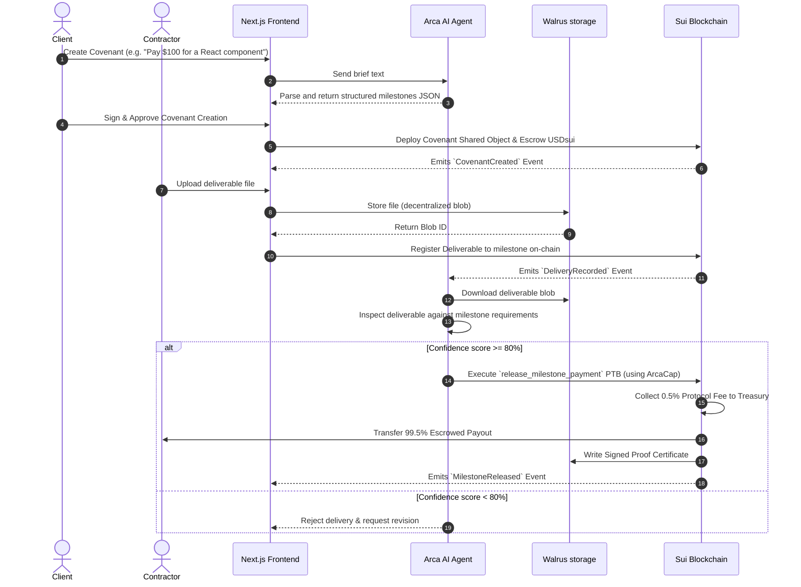

# Accord — Autonomous Work Verification & Payment Protocol

> **Sui Overflow 2026 Hackathon**  
> *Work. Verify. Pay. Automatically.*

---

## 🔍 Overview & Core Vision

### 🔴 The Problem in One Line
Global freelancing suffers from high fees, payment delays, and trust disputes due to subjective manual work verification.

### ❓ Why This Matters
In the global remote work economy ($1.5T annually), **71% of freelancers** face non-payment issues, and payments are delayed by **22 days** on average. Cross-border payments are plagued by high platform fees (up to 20% on Upwork/Fiverr) and expensive wire transfer delays.

### 🧱 Three Layers of the Problem
1. **Agreement Layer (Human Friction)**: Work specifications are written in loose email threads or static PDFs, leading to subjective interpretations and scope creep.
2. **Verification Layer (Execution Friction)**: Checking if a deliverable actually matches the project brief requires manual review, which clients often delay or neglect.
3. **Payment Layer (Financial Friction)**: Escrows are slow to release, manual, and expensive to settle internationally.

---

## 💡 The Solution

Accord is the world's first **autonomous work verification and payment protocol**. It automates escrow and verification using three core pillars:
- **Autonomous Escrow**: Funds are locked in a Sui Smart Contract and released instantly net of a small **0.5% (50 bps) protocol fee**.
- **AI Agent Verification (Arca)**: An AI agent powered by Groq LLM inspects files uploaded to **Walrus Storage** against the covenant specifications.
- **zkLogin Authentication**: Seamless Web2 login experience (like sign-in with Google) generating non-custodial Sui accounts behind the scenes.

---

## ✨ What Makes Accord Unique

1. **Capability-Based Escrow**: Only the authorized `ArcaCap` capability (held by the autonomous Arca Agent) can mutate milestone states or release escrowed payments, rendering unauthorized hacks impossible.
2. **zkLogin Integration**: Contractors and clients log in with Web2 Google OAuth. The system automatically provisions a non-custodial Sui account. No seed phrases, no extension downloads.
3. **Decentralized Blob Storage via Walrus**: Submissions are stored on Walrus testnet. A cryptographically sealed **Proof Certificate** is generated and written back to Walrus permanently for every milestone completion.
4. **On-Chain Reputation Profiles**: Every successful milestone adds to the contractor's immutable, on-chain reputation profile, creating portable trust that isn't locked inside a single web platform.

---

## 🎨 Technical & System Architecture

### 1. Conceptual Architecture

```
+-------------------------------------------------------------------------------------+
|                                   ACCORD PROTOCOL                                   |
+-------------------------------------------------------------------------------------+
|                                                                                     |
|   +-----------------------+                         +---------------------------+   |
|   |       Client          |                         |        Contractor         |   |
|   |   (zkLogin Wallet)    |                         |     (zkLogin Wallet)      |   |
|   +-----------+-----------+                         +-------------+-------------+   |
|               | (Covenant Setup)                                  | (Milestone Delivery)
|               v                                                   v                 |
|   +-----------------------------------------------------------------------------+   |
|   |                              Next.js Frontend                               |   |
|   +-----------+---------------------------+---------------------------+---------+   |
|               | (AI Parser)               | (Store File)              | (Listen Events)
|               v                           v                           v             |
|      +-----------------+         +-----------------+         +------------------+   |
|      |   Arca Agent    |         | Walrus Storage  |         |  Sui Blockchain  |   |
|      |   (Groq LLM)    |         | (Decentralized  |         | (Covenant.move   |   |
|      |                 |         |   Blob Store)   |         |  Escrow Contract)|   |
|      +--------+--------+         +--------+--------+         +--------+---------+   |
|               |                           ^                           ^             |
|               | 1. Read File              |                           |             |
|               +---------------------------+                           |             |
|               |                                                       |             |
|               +------------------ 2. Execute PTB Payment Release -----+             |
|                                                                                     |
+-------------------------------------------------------------------------------------+
```

### 2. Transaction Sequence Flow



---

## 💻 Ecosystem Integration & Code Snippets

### 1. Walrus Blob Storage Integration (`frontend/lib/walrus.ts`)
Contractors upload milestone deliverables directly to the Walrus Testnet blob publisher:

```typescript
import axios from 'axios';

const PUBLISHER_URL = 'https://publisher.walrus-testnet.walrus.space';
const DELIVERABLE_EPOCHS = 5; // Reduced retention for testnet demo

export async function storeDeliverable(file: File) {
  const buffer = await file.arrayBuffer();

  const response = await axios.put(
    `${PUBLISHER_URL}/v1/blobs?epochs=${DELIVERABLE_EPOCHS}`,
    buffer,
    { headers: { 'Content-Type': 'application/octet-stream' } }
  );

  const blobId = response.data?.newlyCreated?.blobObject?.blobId || response.data?.alreadyCertified?.blobId;
  return {
    blobId,
    viewUrl: `https://aggregator.walrus-testnet.walrus.space/v1/blobs/${blobId}`
  };
}
```

### 2. Sui Capability & Escrow Logic (`contracts/accord/sources/covenant.move`)
Capability-based access ensures only the Arca agent holds the administrative `ArcaCap` required to release payments:

```move
module accord::covenant {
    use sui::balance::Balance;
    use sui::coin::Coin;
    use sui::object::{Self, ID, UID};
    use accord::usdsui::USDSUI;

    public struct ArcaCap has key, store { id: UID }

    public struct Milestone has store {
        payout_amount: u64,
        status: u8, // PENDING, DELIVERED, RELEASED, DISPUTED
        walrus_blob_id: Option<vector<u8>>,
    }

    public struct Covenant has key, store {
        id: UID,
        client: address,
        contractor: address,
        escrow: Balance<USDSUI>,
        milestones: vector<Milestone>,
    }

    // Only accounts holding the ArcaCap can trigger payment releases
    public fun release_milestone_payment(
        _cap: &ArcaCap,
        covenant: &mut Covenant,
        milestone_index: u64,
        treasury: address,
        ctx: &mut TxContext
    ): (Coin<USDSUI>, Coin<USDSUI>) {
        let milestone = vector::borrow_mut(&mut covenant.milestones, milestone_index);
        assert!(milestone.status == 1, 101); // Assert STATUS_DELIVERED

        let total_payout = milestone.payout_amount;
        let fee_amount = (total_payout * 50) / 10000; // 0.5% Protocol fee
        let net_payout = total_payout - fee_amount;

        milestone.status = 2; // Set STATUS_RELEASED

        let fee_coin = coin::from_balance(balance::split(&mut covenant.escrow, fee_amount), ctx);
        let contractor_coin = coin::from_balance(balance::split(&mut covenant.escrow, net_payout), ctx);

        (contractor_coin, fee_coin)
    }
}
```

### 3. Gasless / Sponsored Transactions (`frontend/lib/sponsored-tx.ts`)
To make the UX seamless for Web2 users, transaction gas fees can be sponsored by the protocol:

```typescript
import { Transaction } from '@mysten/sui/transactions';

export async function buildSponsoredTransaction(
  tx: Transaction,
  senderAddress: string
): Promise<{ bytes: string; signature: string }> {
  // Call sponsor gas station endpoint
  const response = await fetch('/api/sponsor-tx', {
    method: 'POST',
    body: JSON.stringify({ txBytes: await tx.build(), senderAddress }),
  });
  return response.json();
}
```

---

## 📍 Deployed Contracts

The Accord smart contract is compiled, verified, and deployed on the **Sui Testnet** at:
```
0x832f93729a8b1dfe9dd8067536dfa35231cf019f9401afe04a398df6d18c54cb
```

---

## 🛠️ Repository Structure

```
Accord/
├── agent/                  # Node.js Agent Service (Arca Engine)
│   ├── src/
│   │   ├── certificate/    # PDF Certificate generation & Walrus certification engine
│   │   ├── executor/       # Atomic Sui PTB Execution services
│   │   ├── memory/         # Walrus Memory / reputation tracking
│   │   ├── prompts/        # Groq evaluation system prompts
│   │   ├── verifier/       # LLM Verifier & confidence metrics
│   │   └── index.ts        # Agent Server endpoint
│   └── tsconfig.json
│
├── contracts/              # Sui Move Smart Contracts
│   └── accord/
│       ├── Move.toml       # Package dependencies & network configuration
│       └── sources/
│           ├── covenant.move   # Core Escrow, Milestone, and Agreement logic
│           ├── proof.move      # Walrus Proof Certificate module
│           ├── reputation.move # Cross-project contractor scoring
│           ├── usdsui.move     # Test mock token wrapper for escrow transactions
│           └── errors.move     # Centrally defined contract error codes
│
└── frontend/               # Next.js 14 App Router UI
    ├── app/                # React pages (Dashboard, zkLogin Auth, Covenant Details)
    ├── components/         # UI Elements (ArcaChat, MilestoneTimeline, DeliveryUpload)
    └── lib/                # Sui/Walrus hooks, API wrappers, and zkLogin session state
```

---

## 🚀 Local Setup & Environment

### Step 1 · Frontend Setup
1. Navigate to the `frontend/` directory and copy the environment template:
   ```bash
   cd frontend
   cp .env.example .env
   ```
2. Install dependencies:
   ```bash
   npm install
   ```
3. Run the development server:
   ```bash
   npm run dev
   ```
   Open `http://localhost:3000`.

---

### Step 2 · Google zkLogin Setup
Accord uses Google zkLogin to bypass Web3 wallets setup.
1. Create a client ID on the **[Google Cloud Console Credentials Page](https://console.cloud.google.com/apis/credentials)**.
2. Choose **Web application** and add authorized redirect URI:
   - `http://localhost:3000/auth/callback`
3. Copy your Client ID and add it to `frontend/.env`:
   ```env
   NEXT_PUBLIC_GOOGLE_CLIENT_ID=YOUR_CLIENT_ID_HERE.apps.googleusercontent.com
   ```
4. Restart the Next.js server to enable zkLogin.

---

### Step 3 · Arca Agent Setup
1. Navigate to the `agent/` directory:
   ```bash
   cd agent
   npm install
   ```
2. Setup environment keys:
   ```bash
   cp .env.example .env
   ```
   Fill in your LLM provider key (Groq/Anthropic) and Arca wallet private key.
3. Start the agent:
   ```bash
   npm run start
   ```

---

## 🕹️ End-to-End Test Flow

1. **Sign In**: Log in with Google via **zkLogin** on `http://localhost:3000` to automatically obtain a Sui wallet address.
2. **Covenant Chat Draft**: Type *"Pay 100 mock USDsui for a logo design. 50% on draft, 50% on final files"* into the Arca AI Chat box.
3. **Escrow Funding**: Click **Create & Fund Covenant** to sign the PTB and lock Mock USDSUI tokens into the smart contract escrow.
4. **Deliver Milestone**: Switch view to Contractor, upload any image/file deliverable. It is securely saved on Walrus testnet.
5. **AI Review & Auto-pay**: Arca listens to the on-chain event, checks the Walrus file content against the brief requirements, executes the atomic payout PTB, and deposits funds into the Contractor's zkLogin wallet automatically.